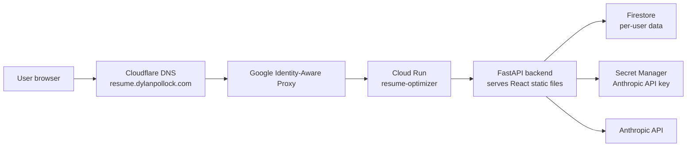

# Deployment Architecture

This document describes the current production deployment for Resume Optimizer and the operational commands needed to manage access.

## Overview

The application runs as a single Cloud Run service in GCP and is protected by Identity-Aware Proxy (IAP). Users must sign in with Google, and only explicitly granted Google accounts can reach the app.



## GCP Resources

- **Project:** `resume-optimizer-500204`
- **Project number:** `450317661331`
- **Region:** `us-west1`
- **Cloud Run service:** `resume-optimizer`
- **Runtime service account:** `resume-optimizer-runtime@resume-optimizer-500204.iam.gserviceaccount.com`
- **Database:** Firestore Native mode
- **Secret:** `anthropic-api-key`
- **IAP audience:** `/projects/450317661331/locations/us-west1/services/resume-optimizer`
- **Default Cloud Run URL:** `https://resume-optimizer-450317661331.us-west1.run.app`
- **Custom domain:** `https://resume.dylanpollock.com`

## Request Flow

1. A user opens `https://resume.dylanpollock.com`.
2. Cloudflare DNS resolves `resume.dylanpollock.com` to Google via `ghs.googlehosted.com`.
3. IAP intercepts the request before it reaches Cloud Run.
4. Google asks the user to sign in.
5. IAP checks whether the signed-in Google account has `roles/iap.httpsResourceAccessor`.
6. If allowed, IAP forwards the request to Cloud Run and includes `x-goog-iap-jwt-assertion`.
7. The FastAPI backend verifies the IAP JWT using `IAP_AUDIENCE`.
8. Backend routes use the verified IAP user ID to isolate that user’s Firestore data.
9. AI endpoints call Anthropic using the API key mounted from Secret Manager.

## Access Management

### Add A User

Grant a friend access to the IAP-protected Cloud Run service:

```bash
gcloud iap web add-iam-policy-binding \
  --project=resume-optimizer-500204 \
  --resource-type=cloud-run \
  --region=us-west1 \
  --service=resume-optimizer \
  --member="user:FRIEND_EMAIL@gmail.com" \
  --role="roles/iap.httpsResourceAccessor"
```

Replace `FRIEND_EMAIL@gmail.com` with their Google account email.

### List Current Users

```bash
gcloud iap web get-iam-policy \
  --project=resume-optimizer-500204 \
  --resource-type=cloud-run \
  --region=us-west1 \
  --service=resume-optimizer
```

Look for the binding with:

```text
role: roles/iap.httpsResourceAccessor
```

### Remove A User

```bash
gcloud iap web remove-iam-policy-binding \
  --project=resume-optimizer-500204 \
  --resource-type=cloud-run \
  --region=us-west1 \
  --service=resume-optimizer \
  --member="user:FRIEND_EMAIL@gmail.com" \
  --role="roles/iap.httpsResourceAccessor"
```

## Domain Mapping

The custom domain uses a Cloud Run domain mapping:

```bash
gcloud beta run domain-mappings describe \
  --project=resume-optimizer-500204 \
  --region=us-west1 \
  --domain=resume.dylanpollock.com
```

Cloudflare DNS should contain:

```text
Type: CNAME
Name: resume
Target: ghs.googlehosted.com
Proxy status: DNS only
```

Keep the Cloudflare record as **DNS only** so Google can validate and renew the managed HTTPS certificate.

## Deployment

Manual source deploy:

```bash
gcloud run deploy resume-optimizer \
  --source . \
  --project=resume-optimizer-500204 \
  --region=us-west1 \
  --service-account=resume-optimizer-runtime@resume-optimizer-500204.iam.gserviceaccount.com \
  --set-env-vars=APP_ENV=production,IAP_AUDIENCE=/projects/450317661331/locations/us-west1/services/resume-optimizer,AI_REQUESTS_PER_HOUR=10 \
  --set-secrets=ANTHROPIC_API_KEY=anthropic-api-key:latest \
  --iap
```

If legacy migration is still needed, include:

```bash
LEGACY_MIGRATION_EMAIL=dpollock1108@gmail.com,LEGACY_MIGRATION_USER_ID=local-user
```

Remove those migration variables after confirming production data is attached to the real IAP user account.

## Secret Rotation

Add a new Anthropic API key version without a trailing newline:

```bash
read -s ANTHROPIC_API_KEY
printf "%s" "$ANTHROPIC_API_KEY" | gcloud secrets versions add anthropic-api-key \
  --data-file=- \
  --project=resume-optimizer-500204
unset ANTHROPIC_API_KEY
```

Then update Cloud Run to use the latest secret version:

```bash
gcloud run services update resume-optimizer \
  --project=resume-optimizer-500204 \
  --region=us-west1 \
  --update-secrets=ANTHROPIC_API_KEY=anthropic-api-key:latest
```

After the app works with the new key, revoke the old key in the Anthropic dashboard.

## Useful Checks

Check the active Cloud Run revision:

```bash
gcloud run services describe resume-optimizer \
  --project=resume-optimizer-500204 \
  --region=us-west1 \
  --format="value(status.latestReadyRevisionName,status.url)"
```

Check DNS:

```bash
dig resume.dylanpollock.com CNAME
```

Read recent Cloud Run logs:

```bash
gcloud logging read \
  'resource.type="cloud_run_revision" AND resource.labels.service_name="resume-optimizer"' \
  --project=resume-optimizer-500204 \
  --limit=50
```
